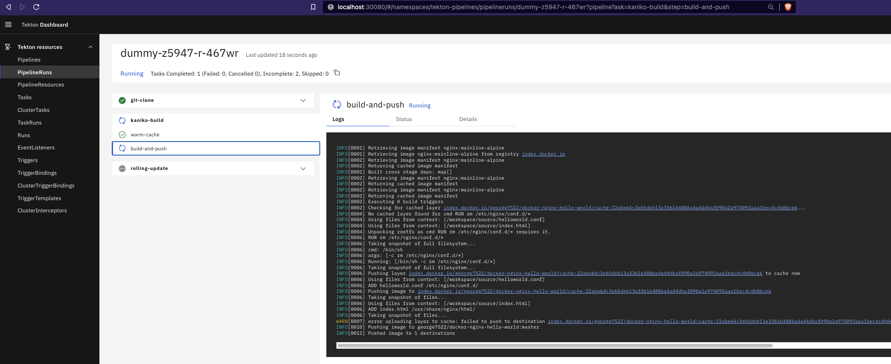
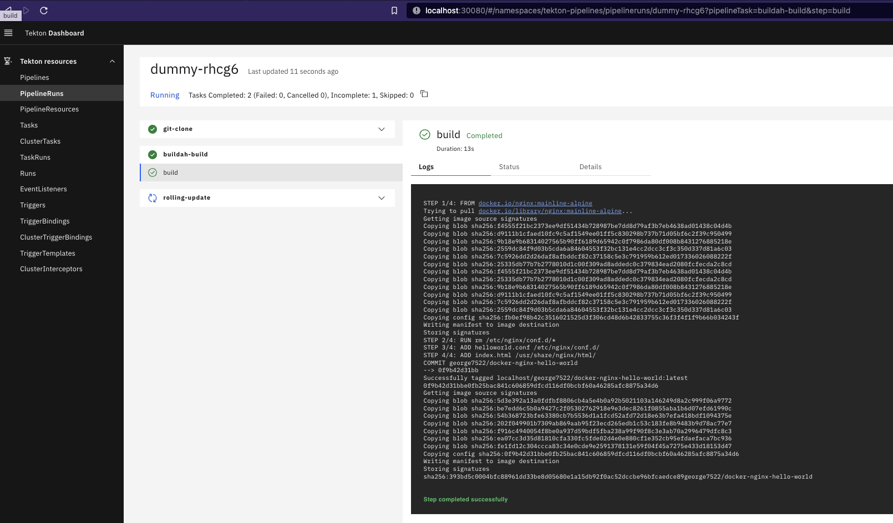

# Tekton Helm Chart - Working Examples 

[Cogito Group's](https://cogitogroup.co.uk) cloud agnostic and generic Tekton Helm chart to install CI/CD pipelines on top of Kubernetes with **one** command. 

See [here](https://github.com/cogitogroupltd/tekton-helm-chart) for the Tekton Helm Chart

## Example 1 - Clone, build and push docker image to ECR using Docker-in-docker

See example [README.md](./tekton-ecr-build-deploy/README.md)

## Example 2 - Clone, build and push docker image to Dockerhub using Kaniko

See example [README.md](./tekton-kaniko-build-deploy/README.md)

## Example 3 - Clone, build and push docker image to Dockerhub using Buildah

See example [README.md](./tekton-buildah-build-deploy/README.md)

